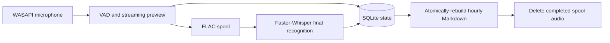

<p align="center">
  
</p>

<p align="center">
  <a href="README.md">繁體中文</a> · <strong>English</strong>
</p>

<h1 align="center">Auto Speech Journal</h1>

<p align="center">
  Turn daily speech into a private, searchable journal that stays on your computer.<br>
  <sub>為繁體中文打造的 Windows 本機語音日記。</sub>
</p>

<p align="center">
  <code>Windows 10/11</code> · <code>Local-first</code> ·
  <code>Whisper</code> · <code>Markdown</code>
</p>

<p align="center">
  <a href="https://github.com/benny7431/auto-speech-journal/releases/download/v0.3.2/AutoSpeechJournal-Setup-0.3.2-x64.exe"><strong>Download Windows stable v0.3.2</strong></a>
  ·
  <a href="#25-second-live-demo"><strong>Watch the 25-second live demo</strong></a>
</p>

## 25-second live demo

[](docs/media/auto-speech-journal-live-demo.mp4)

Click the preview to open the complete silent H.264 MP4.

- **Fully local recognition** — Routine recordings and transcripts are not uploaded to the cloud.
- **Live preview + Whisper final text** — Read words as you speak, then receive a more accurate
  final result.
- **Recoverable Markdown** — The audio spool and SQLite protect in-flight work; journals remain
  ordinary Markdown.

If Auto Speech Journal fits your workflow, use the **Star** button above to follow future releases.

<p align="center">
  <a href="https://github.com/benny7431/auto-speech-journal/actions/workflows/ci.yml"></a>
  <a href="https://github.com/benny7431/auto-speech-journal/actions/workflows/codeql.yml"></a>
  <a href="https://github.com/benny7431/auto-speech-journal/releases/latest"></a>
  <a href="LICENSE"></a>
  
</p>

<details>
<summary>View the reproducible synthetic UI demo and static workspace</summary>


</details>

**Auto Speech Journal** is a resident, local-first voice journal for Windows. It starts after
sign-in, listens continuously to the microphone you explicitly select, shows a low-latency live
preview, produces a more accurate final transcript with Whisper, and organizes the result into one
Markdown file per hour in the Asia/Taipei timezone.

Recognition, storage, and the interface all run locally. The application connects to Hugging Face
only during first-run setup or an explicit model download; routine recording does not send audio
or transcripts to a cloud service.

## Key features

| Feature | Description |
| --- | --- |
| Fully local recognition | Sherpa-ONNX supplies the streaming preview; Faster-Whisper produces final text |
| Two-level interface | A compact always-on-top window shows level, speech activity, and preview; the expanded workspace shows today's timeline |
| Crash recovery | Audio is durably written to the spool and removed only after final transcription and atomic Markdown export |
| Managed correction vocabulary | Corrected segments remain locked; learned terms can be reviewed, removed, cleared, or disabled without losing corrections |
| Portable output | Journals are ordinary Markdown files and do not require a proprietary reader |
| Switchable microphone | Pin a WASAPI endpoint or follow the Windows default without restarting the app |
| Optional sign-in startup | The first-run wizard creates a per-user task pointing to the installed App only after explicit consent |
| Offline visuals | The interface is drawn from paper, type, and a monthly tint alone, and never calls a generative image service at runtime |

## Quick start

### 1. System requirements

- Windows 10/11 x64
- A working WASAPI microphone and Windows microphone permission when recording
- A connection to Hugging Face when the App performs its first model download
- The official Setup follows the CPU-safe path; advanced NVIDIA CUDA installation uses `install.ps1`

### 2. Download and install

**Recommended: [download the `v0.3.2` Windows installer](https://github.com/benny7431/auto-speech-journal/releases/download/v0.3.2/AutoSpeechJournal-Setup-0.3.2-x64.exe) (Stable / Latest)**

> Windows executables are currently unsigned. If Windows shows **Unknown publisher** or
> SmartScreen, verify [`SHA256SUMS.txt`](https://github.com/benny7431/auto-speech-journal/releases/download/v0.3.2/SHA256SUMS.txt); do not disable Defender.

The official Setup does not require Python, `uv`, Git, PowerShell, administrator access, or a
separately installed certificate.

Setup installs only the CPU-safe App and does not download models or GPU components. The
application is installed directly under `%LOCALAPPDATA%\Programs\AutoSpeechJournal\app`. On first
launch, the App downloads ready-to-run ONNX/CTranslate2 models from pinned Hugging Face commits.
The default journal location is:

```text
%USERPROFILE%\Documents\語音紀錄\YYYY-MM-DD\YYYY-MM-DD_HH.md
```

### 3. Complete first-run setup

A fresh installation does not record and does not silently bind itself to a device. On first
launch, explicitly choose one of the following:

- **Follow Windows default**: switch safely at a segment boundary when the default endpoint changes.
- **Fixed device**: keep a specific WASAPI microphone as the preferred input.
- **Configure later**: enter the main UI without recording and keep the setup reminder available.

Also choose a journal folder, optional sign-in startup (off by default), and optional update
notifications (off by default). Recording starts only after **Start recording** is pressed. The
selection is written to
`%LOCALAPPDATA%\AutoSpeechJournal\config.json` and survives reinstallations.
The wizard downloads and verifies the speech models. If the network is interrupted, retry from
first-run setup or later run `AutoSpeechJournal.CLI.exe download-models`. The Hugging Face cache
reuses completed files. **Start recording** remains disabled until models are ready, while
**Configure later** is always available and never opens the microphone.

See [Architecture](docs/ARCHITECTURE.md) for the installer's full behavioral boundary.

## Daily use

### Compact recorder

- Shows recorder state, microphone level, speech activity, pending work, and the live preview.
- **Pause recording** stops accepting new audio; already queued segments still finish processing.
- **Today's journal** opens the expanded workspace.
- The compact window's **X** minimizes the app and does not stop recording.

### Today's audio timeline

- Shows all durable segments for today by hour, with the unsaved live preview fixed at the top.
- **Correct** edits a recent transcript. Human corrections take priority over later model results.
- **Settings** selects, rescans, and tests microphones; it also controls the journal font, 14–26 px
  interface size, records path, and recognition timing.
- **Vocabulary** reviews learned terms and counts, removes individual terms, clears them all, or
  disables future learning without unlocking existing human corrections.
- **Hour management** permanently deletes an hour from SQLite, Markdown, and any remaining spool
  audio.
- The workspace **X** returns to the compact recorder.
- Use **System status → Exit application** to stop both recording and the process.

The settings page shows the five most recent real changes. The complete history is stored in
`%LOCALAPPDATA%\AutoSpeechJournal\settings-history.jsonl`. Loading, migrating, or saving an
unchanged configuration does not create a false history entry.

If a fixed device becomes unavailable, the app preserves the preference and may use the current
Windows default. The UI reports both the preferred and active devices plus the fallback reason.
When the preferred device returns, the app asks before switching back and never changes it abruptly
mid-recording.

## Recognition and persistence flow



- The streaming preview keeps 300 ms of pre-roll, emits its first result immediately, and updates
  at most once every 350 ms afterward.
- If final recognition exceeds 10 seconds, the preview text is published first and replaced in
  place when the final result arrives.
- Each audio segment is durably written as FLAC before processing. It is deleted only after SQLite
  state and Markdown output are complete.
- Segments that are incomplete after a crash, disk lock, or temporary recognition failure remain
  available and resume on the next launch.
- If audio is still waiting for a durable write during shutdown, the app stays open and retries
  rather than forcibly terminating the recorder. Exit again after the write path recovers.
- SQLite is authoritative; Markdown is rebuildable output. Manual Markdown edits are not written
  back and may be overwritten by the next rebuild.

## Data, privacy, and file locations

Routine operation does not upload audio or transcripts. Pinned models are downloaded directly from
Hugging Face only during first-run setup or `download-models`. Once present, recording, VAD,
preview, final recognition, Traditional Chinese conversion, and export all work offline. The
manifest packaged with the App is `src/auto_speech_journal/runtime-models-v1.json`:

- Paraformer: `csukuangfj/sherpa-onnx-streaming-paraformer-bilingual-zh-en` at
  `8e40c43232a1c5c66c82111efc5820d3accca11b`, using three ready-to-run INT8 ONNX/token files.
- Whisper large-v3-turbo: `mobiuslabsgmbh/faster-whisper-large-v3-turbo` at
  `0a363e9161cbc7ed1431c9597a8ceaf0c4f78fcf`, using five ready-to-run CTranslate2 float16 files.
- VAD: `R4kSo1997/sherpa-onnx-silero-vad-v5` at
  `4a6e5a75370a3ca741c950f8feda0dbed11c18ac`, using the Sherpa Silero VAD ONNX file.

The current manifest contains 9 files totaling `1,859,512,338` bytes (about 1.73 GiB). The App uses
the `huggingface_hub` cache and retry behavior. A repeated run reuses completed files and verifies
the pinned revision, size, and SHA-256 before use.

Setup and model download never install Torch, Transformers, or Safetensors and never convert
models on the user's computer. NVIDIA CUDA remains a separate advanced `install.ps1` path and is
not mixed into Setup or model provisioning.

| Data | Default location |
| --- | --- |
| Installed App | `%LOCALAPPDATA%\Programs\AutoSpeechJournal\app` |
| Configuration | `%LOCALAPPDATA%\AutoSpeechJournal\config.json` |
| SQLite state | `%LOCALAPPDATA%\AutoSpeechJournal\state.db` |
| Recognition models | `%LOCALAPPDATA%\AutoSpeechJournal\models` |
| Pending audio | `%LOCALAPPDATA%\AutoSpeechJournal\spool` |
| Runtime log | `%LOCALAPPDATA%\AutoSpeechJournal\logs\journal.log` |
| Settings history | `%LOCALAPPDATA%\AutoSpeechJournal\settings-history.jsonl` |
| Optional local fonts | `%LOCALAPPDATA%\AutoSpeechJournal\fonts` |
| Markdown journals | `%USERPROFILE%\Documents\語音紀錄` |

Place optional TTF/OTF files in the local font directory and rescan from Settings. Fonts are not
part of the wheel or application release; when no optional font is present, the UI uses an
available system font.

## Diagnostics and recovery

First stop the app through **System status → Exit application**, then run the needed command in
PowerShell:

```powershell
$Cli = "$env:LOCALAPPDATA\Programs\AutoSpeechJournal\app\AutoSpeechJournal.CLI.exe"
& $Cli self-test --no-model-check --no-microphone-check
& $Cli download-models
& $Cli startup status
```

### Common situations

**The app starts but does not record**

On a fresh install, or after choosing **Configure later**, select a fixed device or **Follow
Windows default** on the first-run screen or Settings page. The installer itself never selects a
microphone or starts recording for you.

**Models are missing after an interrupted first-run download**

Reconnect and retry in first-run setup, or run `AutoSpeechJournal.CLI.exe download-models`. The
Hugging Face cache reuses completed files; journals, configuration, and pending segments remain.

**The app reports a degraded state**

Inspect the UTF-8 log at `%LOCALAPPDATA%\AutoSpeechJournal\logs\journal.log`. Captured but
untranscribed audio remains in the spool and continues after the problem is repaired and the app
restarts.

**Recording continues after clicking X**

This is expected. Use **System status → Exit application** to stop the application completely.

See [Troubleshooting](docs/TROUBLESHOOTING.md) for WASAPI, permissions, CUDA/CPU, model repair,
scheduled tasks, SQLite/WAL, and spool recovery procedures.

## Uninstalling

Exit the application, then remove Auto Speech Journal from **Windows Settings → Apps**. By default
the uninstaller removes only the program, shortcuts, and its owned sign-in task. It preserves:

- Markdown journals
- `config.json` and `settings-history.jsonl`
- SQLite/WAL files
- Models and spool audio
- Logs and local fonts

A later installation can therefore reuse the configuration and resume incomplete segments. If the
application is no longer needed, back up first and remove retained runtime data manually. The
uninstaller never deletes external Markdown journal folders.

## Documentation, policies, and participation

| Entry | Contents |
| --- | --- |
| [Architecture](docs/ARCHITECTURE.md) | Capture, queues, recovery, export, and deletion boundaries |
| [Troubleshooting](docs/TROUBLESHOOTING.md) | WASAPI, CUDA/CPU, models, scheduled tasks, SQLite/WAL, and spool recovery |
| [Building](docs/BUILDING.md) | Development environment, quality gates, wheel, and synthetic demo |
| [Releasing](docs/RELEASING.md) | Tags, stable/pre-release classification, checksums, and post-release verification |
| [Privacy](PRIVACY.md) | Recording conditions, data locations, network use, retention, and deletion |
| [Third-party notices](THIRD_PARTY_NOTICES.md) | License sources for runtime, CUDA, and Hugging Face models |
| [Security](SECURITY.md) | Supported versions, contact procedure, and sensitive data that must not be posted publicly |
| [Contributing](CONTRIBUTING.md) | Issues, pull requests, diagnostic redaction, and local validation |
| [Changelog](CHANGELOG.md) | Version history in Keep a Changelog format |

## Development and validation

See [Building](docs/BUILDING.md) for requirements, development checks, demo asset regeneration,
Python distributions, and the Windows Setup build; see [Architecture](docs/ARCHITECTURE.md) for
module structure and design boundaries. `tools/replay_fault_recovery.py` replays crash boundaries.

## Current limitations

- Windows WASAPI, Chinese recognition, and the Asia/Taipei timezone only; source development and
  advanced installation use Python 3.11.
- The microphone list includes WASAPI virtual inputs but does not support special loopback capture.
  Indistinguishable duplicate endpoints cannot be pinned; use the Windows default or disable the
  duplicate endpoint.
- Project source and first-party release assets use the MIT License; third-party content keeps its
  own terms.
- Personal local fonts and their legal records are not release contents.

## License

Project source and first-party release assets are licensed under the [MIT License](LICENSE).
Third-party packages, models, fonts, and other external content remain subject to their own terms;
see [THIRD_PARTY_NOTICES.md](THIRD_PARTY_NOTICES.md).

## Use of Codex and GPT-5.6

The developer iterated on this project with GPT-5.6 in OpenAI Codex. The developer retained
responsibility for product direction, feature tradeoffs, privacy and performance decisions, and
validation on real Windows hardware. All generated changes were reviewed and tested by a human.

Codex was used to read and modify Python, QML, and PowerShell files directly and to run Pytest,
Ruff, builds, and local self-tests. This kept each iteration grounded in the actual code and command
output instead of producing unverified snippets.

GPT-5.6 helped turn product requirements into executable steps, trace the data path from capture to
final text, analyze interface and persistence behavior, and design fixes and regression tests for
failure cases. Key decisions include local recognition, durable audio-first capture, SQLite as the
authoritative state, and rebuildable Markdown output.
