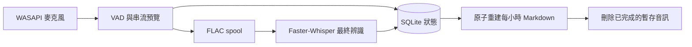

<p align="center">
  
</p>

<h1 align="center">聲跡日記</h1>

<p align="center">
  把每天說過的話，整理成只留在自己電腦裡的日記。
</p>

<p align="center">
  <code>Windows 10/11</code> · <code>Python 3.11</code> ·
  <code>Local-first</code> · <code>繁體中文</code>
</p>

**聲跡日記（Auto Speech Journal）** 是一套 Windows 本機常駐語音日誌。它在登入後
自動啟動，持續監聽你選定的麥克風，先顯示低延遲逐字預覽，再以 Whisper 產生較準確的
最終文字，最後依台北時間整理成每小時一份 Markdown。

辨識、儲存與介面都在本機執行。網路只在安裝或補齊模型時使用；日常錄音不需要把音訊
或文字送到雲端。

> [!IMPORTANT]
> 目前是 `0.1.0` 開發版，僅支援 Windows WASAPI、中文辨識與 `Asia/Taipei` 時區。
> 第一次在新電腦安裝前，請先完成下方的互動式麥克風設定。

## 目錄

- [功能重點](#功能重點)
- [快速開始](#快速開始)
- [日常操作](#日常操作)
- [辨識與保存流程](#辨識與保存流程)
- [資料、隱私與檔案位置](#資料隱私與檔案位置)
- [診斷與修復](#診斷與修復)
- [解除安裝](#解除安裝)
- [開發與驗證](#開發與驗證)
- [目前限制](#目前限制)

## 功能重點

| 功能 | 說明 |
| --- | --- |
| 全程本機辨識 | Sherpa-ONNX 提供即時預覽，Faster-Whisper 產生最終文字 |
| 雙層介面 | 最上層精簡浮窗顯示音量、語音活動與預覽；展開後查看今日聲音時間軸 |
| 當機可恢復 | 音訊先安全寫入 spool；完成最終轉錄與 Markdown 原子寫入後才刪除 |
| 可修正文字 | 修正後的片段會鎖定並學習常用詞，不會被遲到的模型結果覆蓋 |
| 容易帶走 | 預設輸出一般 Markdown，不綁定專用閱讀器 |
| 登入自啟 | 安裝器建立目前使用者的工作排程，登入 20 秒後啟動 |
| 離線視覺 | 月份、狀態場景與粒子效果隨程式安裝，執行時不呼叫生成式影像服務 |

## 快速開始

### 1. 系統需求

- Windows 10/11 x64
- 可用的 WASAPI 麥克風，以及 Windows 麥克風權限
- [uv](https://docs.astral.sh/uv/getting-started/installation/)
- Python 3.11 環境（由 `uv` 管理）
- 首次下載模型需要網路與數 GB 可用空間
- NVIDIA GPU 為選用；沒有相容 GPU 時使用 CPU 安裝方式

### 2. 下載原始碼

在 GitHub 頁面選擇 **Code → Download ZIP** 並解壓縮，或使用 Git clone。接著在專案
根目錄開啟 PowerShell。

### 3. 第一次先選擇麥克風

目前安裝器會以非互動方式驗證已設定的裝置，因此新電腦必須先執行一次互動式設定：

```powershell
uv sync --no-editable --frozen
$env:PYTHONPATH = (Join-Path $PWD "src")
uv run --no-sync python -X utf8 -m auto_speech_journal setup --test-microphone
```

依畫面選擇麥克風與日記資料夾。設定會寫入
`%LOCALAPPDATA%\AutoSpeechJournal\config.json`，之後重新安裝會沿用。

### 4. 安裝並啟用登入自啟

有相容 NVIDIA GPU：

```powershell
Set-ExecutionPolicy -Scope Process Bypass
.\install.ps1
```

沒有相容 NVIDIA GPU，或想強制使用 CPU：

```powershell
Set-ExecutionPolicy -Scope Process Bypass
.\install.ps1 -NoCuda
```

安裝完成後，程式位於 `%LOCALAPPDATA%\AutoSpeechJournal\app`，並由工作排程
**Auto Speech Journal** 啟動。日記預設輸出到：

```text
%USERPROFILE%\Documents\語音紀錄\YYYY-MM-DD\YYYY-MM-DD_HH.md
```

> [!NOTE]
> 原始碼路徑可以包含中文，但工作排程不要直接指向原始碼資料夾。安裝器會先複製到
> 純 ASCII 路徑，再建立非 editable 環境，避開繁體中文 Windows 的路徑編碼問題。

### 安裝選項

| 指令 | 用途 |
| --- | --- |
| `.\install.ps1` | 安裝 CUDA runtime、下載模型、驗證並立即啟動 |
| `.\install.ps1 -NoCuda` | 使用 CPU 完成最終辨識 |
| `.\install.ps1 -SkipModelDownload` | 暫不下載模型；補齊模型前無法正常轉錄 |
| `.\install.ps1 -NoStart` | 完成安裝，但等到下次登入才啟動 |

這些參數可以組合，例如 `.\install.ps1 -NoCuda -NoStart`。

<details>
<summary><strong>安裝器實際會做什麼？</strong></summary>

1. 驗證隨程式提供的離線場景資產。
2. 將程式部署到 `%LOCALAPPDATA%\AutoSpeechJournal\app`。
3. 依 `uv.lock` 建立隔離環境並安裝固定版本相依套件。
4. 驗證已選定的 WASAPI 麥克風，並實際進行短錄音測試。
5. 下載、轉換並以雜湊檢查固定版本的辨識模型。
6. 執行模型推論、SQLite 與輸出資料夾自我檢查。
7. 建立登入工作排程並確認程式、單例 mutex 與日誌都正常。
8. 任一步驟失敗時，回復先前的程式、設定、SQLite/WAL 與排程狀態。

</details>

## 日常操作

### 精簡浮窗

- 顯示目前狀態、麥克風音量、語音活動、待處理數量與即時預覽。
- 按 **暫停錄音** 只會停止接收新音訊；已安全入列的片段仍會完成轉錄。
- 按 **今日紀錄** 展開完整工作台。
- 精簡浮窗右上角的 **X** 只會最小化，不會停止錄音。

### 今日聲音時間軸

- 依小時顯示今天的所有耐久片段；尚未保存的即時預覽固定顯示在頂部。
- 按 **修正** 可修改最近的轉錄。人工修正優先於之後抵達的模型結果。
- **設定** 可調整日記字體、14–26 px 介面字級、紀錄路徑與辨識參數。
- **時段管理** 可永久刪除某個小時的資料庫紀錄、Markdown 與尚存暫存音訊。
- 工作台右上角的 **X** 只會收回精簡浮窗。
- 要真正停止錄音與程式，請使用 **系統狀態 → 結束程式**。

設定頁顯示最近五筆實際變更，完整歷程保存在
`%LOCALAPPDATA%\AutoSpeechJournal\settings-history.jsonl`。單純載入設定、資料遷移
或按下沒有變更的儲存，不會產生假紀錄。

## 辨識與保存流程



- 串流預覽保留 300 ms 起音，第一個結果立即顯示，後續最多每 350 ms 更新。
- 最終辨識超過 10 秒時，程式會先發布預覽文字；最終結果回來後再原位取代。
- 音訊片段會先以 FLAC 安全寫入 spool。只有 SQLite 狀態與 Markdown 都完成後，該片段
  才會刪除。
- 當機、磁碟鎖定或辨識暫時失敗時，尚未完成的片段會保留，重新啟動後繼續處理。
- SQLite 是權威狀態；Markdown 是可重建輸出。請不要把手動修改 Markdown 當成回寫
  方式，下一次重建可能覆蓋那些修改。

## 資料、隱私與檔案位置

日常執行不會上傳音訊或逐字稿。固定版本模型只在安裝或手動補齊時下載；模型就緒後，
錄音、VAD、預覽、最終辨識、正體轉換與匯出都可離線完成。

| 內容 | 預設位置 |
| --- | --- |
| 安裝副本 | `%LOCALAPPDATA%\AutoSpeechJournal\app` |
| 設定 | `%LOCALAPPDATA%\AutoSpeechJournal\config.json` |
| SQLite 狀態 | `%LOCALAPPDATA%\AutoSpeechJournal\state.db` |
| 辨識模型 | `%LOCALAPPDATA%\AutoSpeechJournal\models` |
| 待處理音訊 | `%LOCALAPPDATA%\AutoSpeechJournal\spool` |
| 執行日誌 | `%LOCALAPPDATA%\AutoSpeechJournal\logs\journal.log` |
| 設定歷程 | `%LOCALAPPDATA%\AutoSpeechJournal\settings-history.jsonl` |
| 選用本機字體 | `%LOCALAPPDATA%\AutoSpeechJournal\fonts` |
| Markdown 日記 | `%USERPROFILE%\Documents\語音紀錄` |

本機字體資料夾可放入 TTF/OTF，再從設定頁重新掃描。字體不是 wheel 或安裝包的一部分；
沒有額外字體時，介面會使用可用的系統字體。

## 診斷與修復

先從 **系統狀態 → 結束程式** 停止應用程式，再於 PowerShell 執行需要的命令。

```powershell
$App = "$env:LOCALAPPDATA\AutoSpeechJournal\app"

# 重新選擇麥克風並測試短錄音
& "$App\.venv\Scripts\python.exe" -X utf8 -m auto_speech_journal setup `
  --test-microphone

# 檢查 Python、資料夾、設定、麥克風、模型與 SQLite
& "$App\.venv\Scripts\python.exe" -X utf8 -m auto_speech_journal self-test

# 深度檢查模型雜湊、實際收音與 CUDA 最終推論
& "$App\.venv\Scripts\python.exe" -X utf8 -m auto_speech_journal self-test `
  --deep-model-check --test-microphone

# CPU 安裝的深度推論檢查
& "$App\.venv\Scripts\python.exe" -X utf8 -m auto_speech_journal self-test `
  --deep-model-check --test-microphone --allow-cpu-finalizer
```

### 常見情況

**安裝器顯示找不到設定中的 WASAPI 麥克風**  
回到原始碼目錄，重新執行「第一次先選擇麥克風」的三行命令，再執行安裝器。

**使用 `-SkipModelDownload` 後顯示缺少模型**  
連上網路後重新執行完整安裝器。既有日記、設定與待處理片段會保留。

**程式顯示降級狀態**  
查看 UTF-8 日誌 `%LOCALAPPDATA%\AutoSpeechJournal\logs\journal.log`。已完成收錄但尚未
轉錄的音訊仍留在 spool，修復問題並重新啟動後會繼續處理。

**按 X 後程式仍在錄音**  
這是預期行為。請用 **系統狀態 → 結束程式** 完整停止程式。

## 解除安裝

先從應用程式內完整結束，再在原始碼目錄執行：

```powershell
.\uninstall.ps1
```

解除安裝器只移除工作排程與 `%LOCALAPPDATA%\AutoSpeechJournal\app`。它會保留：

- Markdown 日記
- `config.json` 與 `settings-history.jsonl`
- SQLite/WAL
- 模型與 spool
- 日誌與本機字體

因此之後重新安裝仍可沿用設定，並恢復尚未完成的片段。

## 開發與驗證

在 PowerShell、Python 3.11 與 `uv` 環境下執行：

```powershell
uv sync --no-editable --extra dev
$env:PYTHONPATH = (Join-Path $PWD "src")

uv run --no-sync pytest
uv run --no-sync ruff check src tests
uv run --no-sync python -m auto_speech_journal self-test --no-model-check
uv run --no-sync python tools/validate_scene_assets.py --strict
uv build
uv run --no-sync python tools/verify_wheel_contents.py
```

`tools/replay_fault_recovery.py` 可重播當機邊界；場景與打包 QA 工具集中在 `tools/`。

<details>
<summary><strong>專案結構</strong></summary>

```text
src/auto_speech_journal/
├── cli.py, __main__.py        # CLI 入口
├── ui.py, ui_models.py        # PySide6 / QML 介面橋接
├── controller.py, workers.py  # 狀態協調與背景工作
├── audio.py                   # WASAPI 收音與 FLAC spool
├── preview_engine.py          # Sherpa-ONNX 串流預覽
├── finalizer_engine.py        # Faster-Whisper 最終辨識
├── storage.py, exporter.py    # SQLite 與 Markdown 匯出
└── qml/, assets/              # 介面與離線視覺資產

tests/                         # Pytest 回歸測試
tools/                         # 復原、資產、效能與打包 QA
install.ps1                    # Windows 安裝與工作排程
uninstall.ps1                  # 保留資料的解除安裝
```

</details>

## 目前限制

- 僅支援 Windows WASAPI、Python 3.11、中文辨識與台北時區。
- `install.ps1` 尚未自動偵測 CUDA；請依硬體自行選擇預設安裝或 `-NoCuda`。
- 新電腦仍需先執行一次互動式 setup，安裝器才可非互動驗證正確的麥克風。
- 目前提供原始碼安裝流程，沒有已簽章的 EXE/MSI。
- 專案尚未加入公開 `LICENSE`，`pyproject.toml` 目前仍標示 `Proprietary`。
- 個人本機字體與其聲明不屬於發行內容。

## 開發說明

本專案由開發者與 OpenAI Codex 協作迭代。開發者負責產品方向、隱私與效能取捨及
Windows 實機驗證；Codex 協助架構、實作、除錯、測試與程式碼審查。
