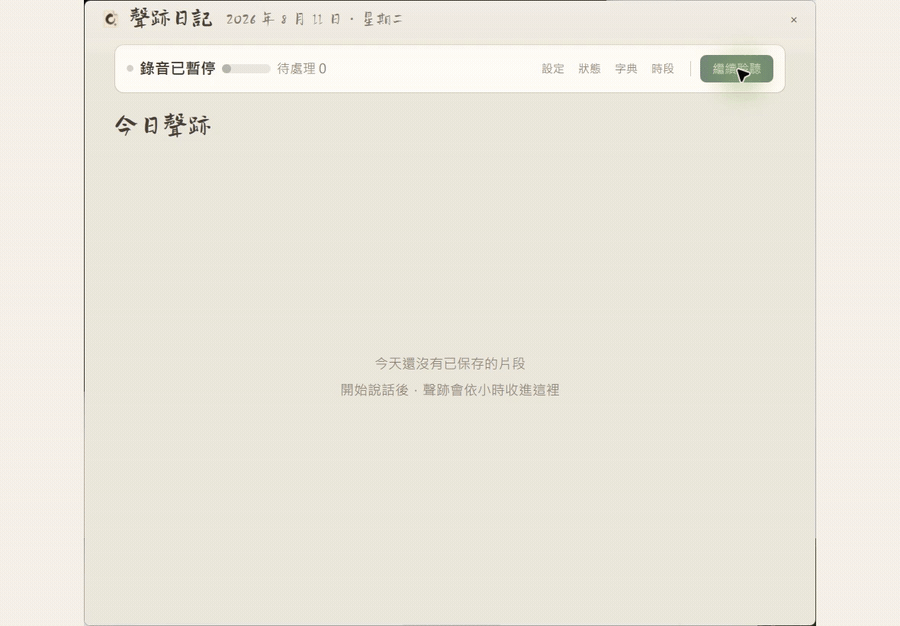
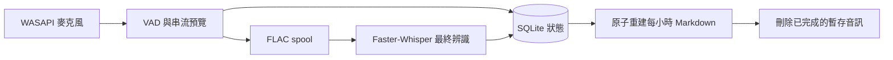

<p align="center">
  
</p>

<p align="center">
  <strong>繁體中文</strong> · <a href="README.en.md">English</a>
</p>

<h1 align="center">聲跡日記</h1>

<p align="center">
  把每天說過的話，整理成只留在自己電腦裡的日記。<br>
  <sub>Local-first Windows voice journal for Traditional Chinese.</sub>
</p>

<p align="center">
  <code>Windows 10/11</code> · <code>Local-first</code> ·
  <code>Whisper</code> · <code>Markdown</code>
</p>

<p align="center">
  <a href="https://github.com/benny7431/auto-speech-journal/releases/download/v0.3.2/AutoSpeechJournal-Setup-0.3.2-x64.exe"><strong>下載 Windows 正式版 v0.3.2</strong></a>
  ·
  <a href="#25-秒真機-demo"><strong>觀看 25 秒真機 Demo</strong></a>
</p>

## 25 秒真機 Demo

[](docs/media/auto-speech-journal-live-demo.mp4)

點擊畫面可開啟無音軌的 H.264 MP4 完整影片。

- **全程本機辨識** — 日常錄音與逐字稿不上雲端。
- **即時預覽 + Whisper 定稿** — 邊說邊看，片段完成後自動換成較準確結果。
- **可恢復的 Markdown** — audio spool 與 SQLite 保護處理中資料，成果輸出為一般 Markdown。

如果聲跡日記符合你的需求，歡迎在右上角按下 **Star**，追蹤後續版本。

<p align="center">
  <a href="https://github.com/benny7431/auto-speech-journal/actions/workflows/ci.yml"></a>
  <a href="https://github.com/benny7431/auto-speech-journal/actions/workflows/codeql.yml"></a>
  <a href="https://github.com/benny7431/auto-speech-journal/releases/latest"></a>
  <a href="LICENSE"></a>
  
</p>

<details>
<summary>查看可重現的合成 UI 示範與靜態工作台</summary>


</details>

**聲跡日記（Auto Speech Journal）** 是一套 Windows 本機常駐語音日誌。它可依你的選擇在登入後
啟動，持續監聽你選定的麥克風，先顯示低延遲逐字預覽，再以 Whisper 產生較準確的
最終文字，最後依台北時間整理成每小時一份 Markdown。

辨識、儲存與介面都在本機執行。網路只在首次設定或手動下載模型時連線至 Hugging
Face；日常錄音不需要把音訊或文字送到雲端。

## 目錄

- [功能重點](#功能重點)
- [快速開始](#快速開始)
- [日常操作](#日常操作)
- [辨識與保存流程](#辨識與保存流程)
- [資料、隱私與檔案位置](#資料隱私與檔案位置)
- [診斷與修復](#診斷與修復)
- [解除安裝](#解除安裝)
- [文件、政策與參與](#文件政策與參與)
- [開發與驗證](#開發與驗證)
- [目前限制](#目前限制)
- [使用 Codex 與 GPT-5.6](#使用-codex-與-gpt-56)

## 功能重點

| 功能 | 說明 |
| --- | --- |
| 全程本機辨識 | Sherpa-ONNX 提供即時預覽，Faster-Whisper 產生最終文字 |
| 雙層介面 | 最上層精簡浮窗顯示音量、語音活動與預覽；展開後查看今日聲音時間軸 |
| 當機可恢復 | 音訊先安全寫入 spool；完成最終轉錄與 Markdown 原子寫入後才刪除 |
| 可管理校正字典 | 修正後的片段會鎖定；可查看已學詞與次數、刪除或清空詞語，並停用自動學習 |
| 容易帶走 | 預設輸出一般 Markdown，不綁定專用閱讀器 |
| 麥克風可切換 | 可固定使用某個 WASAPI 端點，或跟隨 Windows 預設，切換不需重開 App |
| 選用登入自啟 | 首次設定明確同意後，才建立指向已安裝 App 的個人工作排程 |
| 離線視覺 | 介面只用紙面、字體與月份色調呈現，執行時不呼叫生成式影像服務 |

## 快速開始

### 1. 系統需求

- Windows 10/11 x64
- 錄音時需要可用的 WASAPI 麥克風，以及 Windows 麥克風權限
- 首次啟動下載模型時需要連線至 Hugging Face
- 正式 Setup 使用 CPU-safe 路徑；進階 NVIDIA CUDA 安裝請使用 `install.ps1`

### 2. 下載並安裝

**推薦版本：[下載 `v0.3.2` Windows 安裝程式](https://github.com/benny7431/auto-speech-journal/releases/download/v0.3.2/AutoSpeechJournal-Setup-0.3.2-x64.exe)（Stable / Latest）**

> Windows 執行檔目前未簽章；若出現「未知的發行者」或 SmartScreen，請核對
> [`SHA256SUMS.txt`](https://github.com/benny7431/auto-speech-journal/releases/download/v0.3.2/SHA256SUMS.txt)，無須停用 Defender。

正式 Setup 不需要 Python、`uv`、Git、PowerShell、管理員權限或另外安裝憑證。

Setup 只安裝 CPU-safe App，不下載模型或 GPU 元件。程式會直接安裝到
`%LOCALAPPDATA%\Programs\AutoSpeechJournal\app`。首次啟動時，App 才從固定 Hugging
Face commit 下載可直接執行的 ONNX／CTranslate2 模型。日記預設輸出到：

```text
%USERPROFILE%\Documents\語音紀錄\YYYY-MM-DD\YYYY-MM-DD_HH.md
```

### 3. 完成首次設定

新安裝預設不錄音，也不會暗中綁定某台電腦的裝置。第一次啟動時請主動選擇：

- **跟隨 Windows 預設**：預設輸入端點改變時，App 會在片段邊界安全切換。
- **固定裝置**：持續偏好指定的 WASAPI 麥克風。
- **稍後設定**：先進入主介面但不錄音；提示會保留，之後可從設定頁選擇。

還需選擇日記資料夾、是否登入自啟（預設關閉）與是否開啟更新提示
（預設關閉）。只有最後按下 **開始錄音** 才會儲存同意並啟動 worker。設定會寫入
`%LOCALAPPDATA%\AutoSpeechJournal\config.json`，重新安裝時會沿用。
Wizard 會下載並驗證語音模型；若網路中斷，可在首次設定重試，或稍後執行
`AutoSpeechJournal.CLI.exe download-models`。Hugging Face cache 會重用已完成的檔案。
模型未就緒前「開始錄音」會保持停用，但 **稍後設定** 永遠可用且不會開啟麥克風。

<details>
<summary><strong>安裝器實際會做什麼？</strong></summary>

1. 將 PyInstaller onedir 的 CPU-safe App 直接安裝到固定 `app` 目錄。
2. 建立開始選單捷徑與 Windows「應用程式」解除安裝項目。
3. 不下載模型或 NVIDIA runtime；模型由首次啟動的 App 負責。
4. 不開啟麥克風、不建立登入自啟，也不刪除既有 runtime 資料或外部日記。

</details>

## 日常操作

### 精簡浮窗

- 顯示目前狀態、麥克風音量、語音活動、待處理數量與即時預覽。
- 按 **暫停錄音** 只會停止接收新音訊；已安全入列的片段仍會完成轉錄。
- 按 **今日紀錄** 展開完整工作台。
- 精簡浮窗右上角的 **X** 只會最小化，不會停止錄音。

### 今日聲音時間軸

- 依小時顯示今天的所有耐久片段；尚未保存的即時預覽固定顯示在頂部。
- 按 **修正** 可修改最近的轉錄。人工修正優先於之後抵達的模型結果。
- **設定** 可選擇麥克風、重新掃描與測試所選裝置，也可調整日記字體、14–26 px
  介面字級、紀錄路徑與辨識參數。
- **字典** 可查看已學詞與累計次數、刪除單一詞、清空全部詞語，或停用後續自動學習；這些操作不會解除人工修正鎖定。
- **時段管理** 可永久刪除某個小時的資料庫紀錄、Markdown 與尚存暫存音訊。
- 工作台右上角的 **X** 只會收回精簡浮窗。
- 要真正停止錄音與程式，請使用 **系統狀態 → 結束程式**。

設定頁顯示最近五筆實際變更，完整歷程保存在
`%LOCALAPPDATA%\AutoSpeechJournal\settings-history.jsonl`。單純載入設定、資料遷移
或按下沒有變更的儲存，不會產生假紀錄。

固定裝置暫時失效時，App 會保留原偏好並嘗試使用當下的 Windows 預設。介面會分別顯示
「偏好裝置」與「目前收音裝置」及 fallback 原因；偏好裝置恢復後只會提示，由你按
**切回偏好裝置**，不會在錄音中突然自動切回。

## 辨識與保存流程



- 串流預覽保留 300 ms 起音，第一個結果立即顯示，後續最多每 350 ms 更新。
- 最終辨識超過 10 秒時，程式會先發布預覽文字；最終結果回來後再原位取代。
- 音訊片段會先以 FLAC 安全寫入 spool。只有 SQLite 狀態與 Markdown 都完成後，該片段
  才會刪除。
- 當機、磁碟鎖定或辨識暫時失敗時，尚未完成的片段會保留，重新啟動後繼續處理。
- 若結束程式時仍有音訊等候耐久寫入，App 會保持開啟並重試，不會為了逾時而強制終止
  recorder；寫入恢復後再按一次 **結束程式** 即可。
- SQLite 是權威狀態；Markdown 是可重建輸出。請不要把手動修改 Markdown 當成回寫
  方式，下一次重建可能覆蓋那些修改。

## 資料、隱私與檔案位置

日常執行不會上傳音訊或逐字稿。固定版本模型只在首次設定或 `download-models` 時直接
從 Hugging Face 下載；模型就緒後，錄音、VAD、預覽、最終辨識、正體轉換與匯出都可
離線完成。下載清單隨 App 封裝在
`src/auto_speech_journal/runtime-models-v1.json`：

- Paraformer：`csukuangfj/sherpa-onnx-streaming-paraformer-bilingual-zh-en` @
  `8e40c43232a1c5c66c82111efc5820d3accca11b`，直接使用三個 INT8 ONNX／tokens 檔案。
- Whisper large-v3-turbo：`mobiuslabsgmbh/faster-whisper-large-v3-turbo` @
  `0a363e9161cbc7ed1431c9597a8ceaf0c4f78fcf`，直接使用五個 CTranslate2 float16 檔案。
- VAD：`R4kSo1997/sherpa-onnx-silero-vad-v5` @
  `4a6e5a75370a3ca741c950f8feda0dbed11c18ac`，直接使用 Sherpa Silero VAD ONNX。

目前 manifest 共 9 個檔案、`1,859,512,338` bytes（約 1.73 GiB）。App 使用
`huggingface_hub` 的 cache 與 retry；中斷後重新執行只會補齊未完成的檔案，並在使用前
核對固定 revision、大小與 SHA-256。

Setup 與模型下載都不會安裝 Torch、Transformers 或 Safetensors，也不會在使用者電腦
轉換模型。NVIDIA CUDA 是獨立的進階 `install.ps1` 路徑，不混入 Setup 或模型流程。

| 內容 | 預設位置 |
| --- | --- |
| 已安裝 App | `%LOCALAPPDATA%\Programs\AutoSpeechJournal\app` |
| 設定 | `%LOCALAPPDATA%\AutoSpeechJournal\config.json` |
| SQLite 狀態 | `%LOCALAPPDATA%\AutoSpeechJournal\state.db` |
| 辨識模型 | `%LOCALAPPDATA%\AutoSpeechJournal\models` |
| 待處理音訊 | `%LOCALAPPDATA%\AutoSpeechJournal\spool` |
| 執行日誌 | `%LOCALAPPDATA%\AutoSpeechJournal\logs\journal.log` |
| 設定歷程 | `%LOCALAPPDATA%\AutoSpeechJournal\settings-history.jsonl` |
| 選用本機字體 | `%LOCALAPPDATA%\AutoSpeechJournal\fonts` |
| Markdown 日記 | `%USERPROFILE%\Documents\語音紀錄` |

本機字體資料夾可放入 TTF/OTF，再從設定頁重新掃描。字體不是 wheel 或安裝包的一部分；
沒有額外字體時，介面會使用可用的系統字體。

## 診斷與修復

先從 **系統狀態 → 結束程式** 停止應用程式，再於 PowerShell 執行需要的命令。

```powershell
$Cli = "$env:LOCALAPPDATA\Programs\AutoSpeechJournal\app\AutoSpeechJournal.CLI.exe"
& $Cli self-test --no-model-check --no-microphone-check
& $Cli download-models
& $Cli startup status
```

### 常見情況

**App 啟動後沒有錄音**

新安裝或曾選擇「稍後設定」時，請在首次畫面或設定頁選擇固定裝置或
「跟隨 Windows 預設」。安裝器本身不會要求麥克風，也不會替你開始錄音。

**首次設定下載中斷後顯示缺少模型**

連上網路後回到首次設定重試，或執行 `AutoSpeechJournal.CLI.exe download-models`。
Hugging Face cache 會重用已完成的檔案；既有日記、設定與待處理片段會保留。

**程式顯示降級狀態**

查看 UTF-8 日誌 `%LOCALAPPDATA%\AutoSpeechJournal\logs\journal.log`。已完成收錄但尚未
轉錄的音訊仍留在 spool，修復問題並重新啟動後會繼續處理。

**按 X 後程式仍在錄音**

這是預期行為。請用 **系統狀態 → 結束程式** 完整停止程式。

WASAPI、權限、CUDA/CPU、模型修復、排程工作、SQLite/WAL 與 spool 復原程序，
見 [疑難排解](docs/TROUBLESHOOTING.md)。

## 解除安裝

先從應用程式內完整結束，再從 **Windows 設定 → 應用程式** 移除 Auto Speech Journal。
預設只移除程式、捷徑與本專案擁有的自啟 task，並保留：

- Markdown 日記
- `config.json` 與 `settings-history.jsonl`
- SQLite/WAL
- 模型與 spool
- 日誌與本機字體

因此之後重新安裝仍可沿用設定，並恢復尚未完成的片段。若確定不再使用，請先備份後
自行刪除保留的 runtime 資料；外部 Markdown 日記資料夾永遠不會由解除安裝程式刪除。

## 文件、政策與參與

| 入口 | 內容 |
| --- | --- |
| [架構](docs/ARCHITECTURE.md) | 收音、佇列、復原、匯出與刪除邊界 |
| [疑難排解](docs/TROUBLESHOOTING.md) | WASAPI、CUDA/CPU、模型、工作排程、SQLite/WAL 與 spool |
| [建置](docs/BUILDING.md) | 開發環境、品質門檻、wheel 與合成 Demo |
| [發布](docs/RELEASING.md) | tag、Stable／Pre-release、checksum 與發布後驗證 |
| [隱私政策](PRIVACY.md) | 收音條件、資料位置、連網時機、保存與刪除方式 |
| [第三方聲明](THIRD_PARTY_NOTICES.md) | runtime、CUDA 與 Hugging Face 模型的授權來源 |
| [安全政策](SECURITY.md) | 支援版本、安全聯絡方式與禁止公開附加的敏感資料 |
| [貢獻指南](CONTRIBUTING.md) | Issue、PR、診斷資料去識別化與本機驗證流程 |
| [版本歷程](CHANGELOG.md) | Keep a Changelog 格式的版本變更 |

## 開發與驗證

在 PowerShell、Python 3.11 與 `uv` 環境下執行：

```powershell
uv sync --frozen --no-editable --extra dev
$env:PYTHONPATH = (Join-Path $PWD "src")

uv run --no-sync pytest --cov=auto_speech_journal --cov-report=term-missing `
  --cov-report=xml
uv run --no-sync ruff check src tests tools
uv run --no-sync python -m auto_speech_journal self-test `
  --no-model-check --no-microphone-check
uv build
uv run --no-sync python tools/verify_wheel_contents.py
uv run --no-sync pre-commit run --all-files
uv run --no-sync python tools/render_readme_demo.py
```

完整說明請見 [建置文件](docs/BUILDING.md)。`tools/replay_fault_recovery.py` 可重播當機
邊界；基準圖、Demo 與打包 QA 工具集中在 `tools/`。

<details>
<summary><strong>專案結構</strong></summary>

```text
src/auto_speech_journal/
├── cli.py, __main__.py        # CLI 入口
├── ui.py, ui_models.py        # PySide6 / QML 介面橋接
├── controller.py, workers.py  # 狀態協調與背景工作
├── audio.py                   # WASAPI 收音與 FLAC spool
├── preview_engine.py          # Sherpa-ONNX 串流預覽
├── finalizer_engine.py        # Faster-Whisper 最終辨識
├── storage.py, exporter.py    # SQLite 與 Markdown 匯出
└── qml/, assets/              # 介面與品牌資產

tests/                         # Pytest 回歸測試
packaging/                     # PyInstaller、Inno Setup 與最小發布驗證
tools/                         # 復原、基準圖、效能與打包 QA
install.ps1, uninstall.ps1     # 進階 source/CUDA 安裝與救援流程
app-control.ps1                # 上述兩支腳本共用的行程與 mutex 輔助函式
```

</details>

## 目前限制

- 目前僅支援 Windows WASAPI、中文辨識與台北時區；原始碼開發與進階安裝使用 Python 3.11。
- 麥克風清單包含 WASAPI 虛擬輸入，但不支援特殊 loopback capture；無法安全區分的
  同名端點不能固定綁定，請改用 Windows 預設或停用重複端點。
- 專案原始碼與專案自有發行資產採 MIT License；第三方內容仍受各自條款約束。
- 個人本機字體與其聲明不屬於發行內容。

## 授權

本專案原始碼與專案自有發行資產採 [MIT License](LICENSE)。第三方套件、模型、字體與其他
外部內容仍受各自的授權條款約束；完整清單請見
[THIRD_PARTY_NOTICES.md](THIRD_PARTY_NOTICES.md)。

## 使用 Codex 與 GPT-5.6

本專案由開發者在 OpenAI Codex 中與 GPT-5.6 協作迭代。開發者負責產品方向、功能
取捨、隱私與效能決策，以及 Windows 實機驗證；所有生成的修改都經過人工檢視與測試。

Codex 用於直接閱讀與修改專案中的 Python、QML 與 PowerShell 檔案，並執行 Pytest、
Ruff、建置及本機自我檢查。這讓每次修改都能根據實際程式碼、命令輸出與執行結果繼續
迭代，而不是只產生未驗證的程式片段。

GPT-5.6 用於將產品需求拆成可執行步驟、追蹤錄音到最終文字的資料流程、分析介面與
持久化問題，以及針對失敗案例設計修補與回歸測試。關鍵決策包括本機辨識、音訊先落盤、
SQLite 作為權威狀態，以及可重建的 Markdown 輸出。
