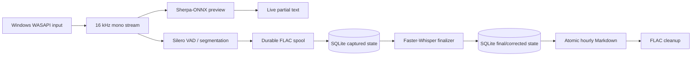

# Architecture

Auto Speech Journal 是 Windows-only、本機優先的桌面應用程式。SQLite 保存權威狀態，
每小時 Markdown 是可重建輸出；錄音、預覽與最終辨識都不依賴遠端 API。

## End-to-end data flow

The ordering is intentional:

1. The recorder resamples WASAPI input to 16 kHz mono and sends chunks to preview/VAD logic.
2. A completed speech segment is written to FLAC before a `CapturedSegment` event is published.
3. The main controller inserts the captured record into SQLite before submitting it to the
   finalizer queue.
4. Final text is committed to SQLite, then the affected hourly Markdown file is atomically rebuilt.
5. Spool audio is deleted only after durable state and output cleanup have succeeded.

This means a full queue or failed model cannot discard audio that has already crossed the durable
FLAC boundary.

## Runtime components

| Component | Responsibility |
| --- | --- |
| `cli.py` | Commands, logging setup, singleton guard and runtime composition |
| `audio.py` | WASAPI discovery/capture, resampling, segmentation and FLAC spool |
| `workers.py` | Recorder, preview and finalizer process lifecycle and bounded queues |
| `preview_engine.py` | Low-latency Sherpa-ONNX streaming recognition and OpenCC normalization |
| `finalizer_engine.py` | CTranslate2/Faster-Whisper final transcription with CUDA/CPU profiles |
| `controller.py` | State transitions, durable ordering, retry policy and user actions |
| `storage.py` | SQLite schema, WAL transactions, recovery and correction locks |
| `exporter.py` | Atomic Markdown rebuild, deletion and post-export FLAC cleanup |
| `vocabulary.py` | Learned correction terms without weakening user-locked transcripts |
| `ui.py` / `ui_models.py` | PySide6/QML bridge and immutable timeline read models |

The Qt event loop and controller run in the main process. `JournalWorkers` owns isolated recorder,
preview and finalizer processes connected by bounded multiprocessing queues. Native/heavy imports
are delayed until the corresponding command or worker starts, keeping offline tests importable.

## State and recovery

SQLite runs with WAL, foreign keys and secure deletion enabled. Segment state progresses through
captured/finalizing/final-ready/exported/audio-deleted states, with retry and failed states retaining
enough provenance to resume.

At startup the application:

1. Reconciles SQLite rows and the spool directory.
2. Recovers durable FLAC files that did not complete controller delivery before a crash.
3. Repairs pathological final transcripts using retained preview text where safe.
4. Rebuilds dirty hourly Markdown files.
5. Requeues pending finalization work after workers become ready.

Artificial timeouts never authorize deletion of uncommitted speech. On shutdown the recorder can
hold the application open while captured audio is still waiting for durable storage.

## Corrections and deletion

An explicit correction writes `corrected_text`, sets `user_locked`, rebuilds Markdown and may update
learned vocabulary. A late model result cannot replace user-locked text. Vocabulary deletion changes
future hints only; it does not unlock past corrections.

Deleting an hour coordinates SQLite deletion, Markdown removal/rebuild and remaining spool cleanup.
The uninstaller deliberately does not call this path and therefore preserves user data.

## Network and packaging boundaries

The normal `run` path has no HTTP client or cloud transcription integration. Network access exists
only in dependency installation and explicit model download/repair. Model identifiers, revisions,
sizes and SHA-256 digests are pinned in `model_download.py`.

The wheel contains Python, QML and 192 offline scene assets. It excludes models, recordings,
databases, logs, settings, local fonts and machine-local generation paths. See
[THIRD_PARTY_NOTICES.md](../THIRD_PARTY_NOTICES.md) and [PRIVACY.md](../PRIVACY.md).
