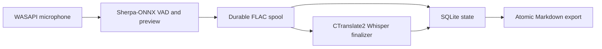

# Architecture

Auto Speech Journal 是 local-first Windows 應用程式。SQLite 是權威狀態；Markdown
日記是可重建輸出。



## Runtime modules

| Module | Responsibility |
|---|---|
| `audio.py` | Windows audio capture and device selection |
| `preview_engine.py` | Sherpa-ONNX streaming preview and VAD |
| `finalizer_engine.py` | CTranslate2 Whisper final transcription |
| `workers.py` | Capture, preview, finalization, and recovery coordination |
| `storage.py` | SQLite transactions and durable state |
| `exporter.py` | Rebuildable, atomic Markdown output |
| `setup_wizard.py` | First-run consent, journal folder, startup, and microphone setup |
| `model_download.py` | Pinned Hugging Face runtime-model provisioning |

## Consent and persistence

First run is a wizard. It tests the journal folder and microphone, but recording starts only after
the user presses「開始錄音」. Choosing「稍後設定」keeps recording and login startup disabled.
Settings changes are transactional: a failed test restores the previously working values.

SQLite remains the authority across crashes and upgrades. Audio is written to the spool before
finalization, and Markdown can be regenerated from database state.

## Model boundary

`src/auto_speech_journal/runtime-models-v1.json` is packaged with the application. Every runtime
file records its Hugging Face repository, full commit revision, path, size, SHA-256, license, and
source. The manifest permits only directly executable ONNX and CTranslate2 artifacts.

The App downloads those files through `huggingface_hub` during first-run setup, using the Hugging
Face cache and retry behavior. User machines do not install Torch or Transformers and do not
convert models. A model failure leaves the application and persistent state intact so setup can
resume later.

Model provisioning is separate from optional CUDA support. The normal Setup installs a CPU-safe
application and never downloads models or NVIDIA runtime components. Advanced CUDA installation
remains available through `install.ps1`.

## Installation boundary

Inno Setup installs the PyInstaller onedir payload directly to:

```text
%LOCALAPPDATA%\Programs\AutoSpeechJournal\app
```

This release has no stable launcher, `current.json`, versioned application directories, or custom
rollback service. Runtime data stays separately under `%LOCALAPPDATA%\AutoSpeechJournal`, and
external journal directories are never owned by the installer. Uninstall therefore removes the
application and its shortcuts/startup registration while preserving runtime data and journals.
